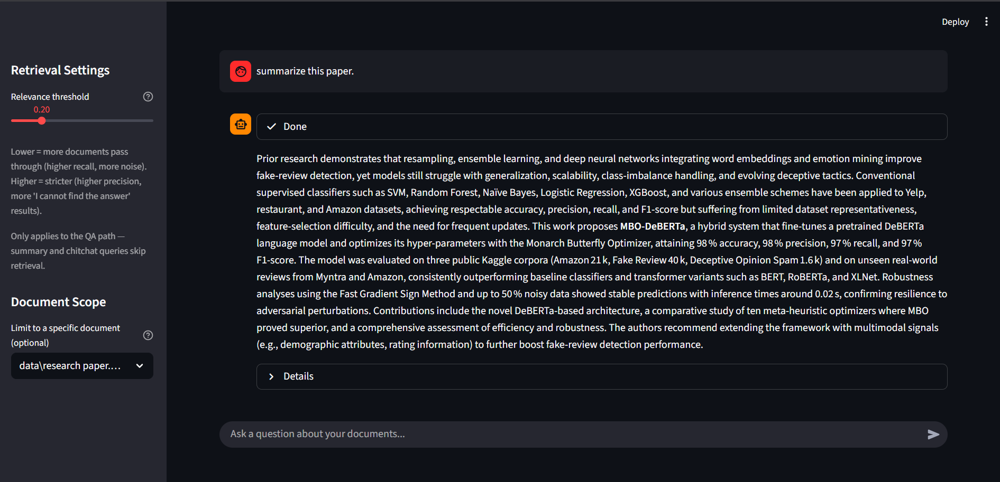
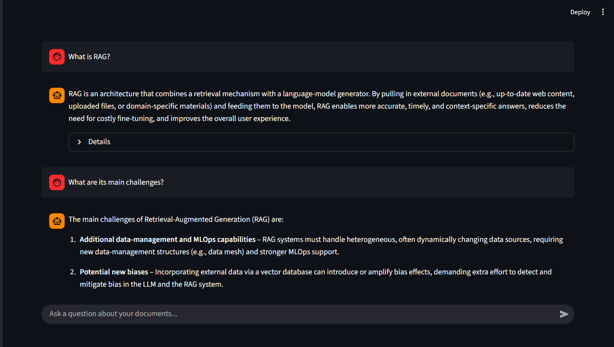

# PDF RAG Chatbot

A retrieval-augmented generation (RAG) chatbot that answers questions, summarizes, and chats naturally over a corpus of ingested PDFs — built with a hybrid retrieval pipeline and an intent-routed LangGraph orchestration layer, rather than a single linear "embed → retrieve → generate" chain.

Live in a Streamlit UI with adjustable retrieval settings, per-document scoping, and full transparency into what was retrieved and why.

---

## Why this isn't just another "chat with your PDF" project

Most RAG demos wire together an embedding model, a vector store, and an LLM call. This project adds the layers that actually matter for retrieval quality and reliability in practice:

- **Hybrid retrieval (dense + sparse)** — an `EnsembleRetriever` combining semantic vector search (Chroma + BGE embeddings) with BM25 keyword search, so exact terms and acronyms aren't lost to embedding-only similarity.
- **Parent-document retrieval** — child chunks (400 chars) are used for precise embedding matches, but the LLM is given the larger parent window (2000 chars) they came from, avoiding fragmented, context-starved generations.
- **Cross-encoder reranking** — a FlashRank reranker re-scores retrieved candidates before a relevance threshold filters out weak matches, rather than trusting raw similarity scores.
- **Intent-routed graph, not a linear chain** — a LangGraph `StateGraph` classifies each query as `qa`, `summary`, or `chitchat` and routes to a dedicated path for each, instead of forcing every message (including "hi" or "summarize this doc") through the same retrieve-and-answer pipeline.
- **Cost-aware summary path** — single-shot summarization for documents that fit the context budget, falling back to batched map-reduce only for larger documents, keeping API costs and rate-limit exposure predictable.
- **A real evaluation harness** — retrieval hit rate, MRR, and LLM-judged faithfulness, measured against a hand-labeled question set, not eyeballed from a handful of manual queries.

## Architecture

```
User Query
    │
    ▼
detect_intent ──────────────┬──────────────┬──────────────┐
    │ qa                    │ summary      │ chitchat     │
    ▼                       ▼              ▼
reformulate              summarize_document   chitchat
    │                       │              │
    ▼                       │              │
retrieve (hybrid:           │              │
 vector + BM25)             │              │
    │                       │              │
    ▼                       │              │
grade (rerank +             │              │
 threshold filter)          │              │
    │                       │              │
    ▼                       │              │
generate                    │              │
    │                       │              │
    └───────────────────────┴──────────────┴──► END
```

- **`reformulate`** — rewrites follow-up questions into standalone search queries using chat history (with a length-based safety net against a small model accidentally answering instead of rewriting).
- **`retrieve`** — hybrid ensemble search (vector + BM25), expanded from child chunks to parent context, optionally scoped to a single ingested document.
- **`grade`** — FlashRank cross-encoder reranking, then a configurable relevance threshold drops weak matches.
- **`generate`** — strict, context-only answer generation; explicitly instructed to refuse rather than fall back on the model's own pretrained knowledge.
- **`summarize_document`** — bypasses similarity search entirely (a "summarize this doc" query has no single relevant chunk to retrieve); pulls every parent chunk for the resolved document straight from the docstore.
- **`chitchat`** — skips retrieval so greetings and small talk don't trigger the QA path's "I cannot find the answer" fallback.

## Tech Stack

| Layer | Technology |
|---|---|
| Orchestration | LangGraph (`StateGraph`, conditional edges) |
| Vector store | ChromaDB |
| Embeddings | `BAAI/bge-small-en-v1.5` (HuggingFace) |
| Keyword search | BM25 (rebuilt on document-count change) |
| Reranking | FlashRank (`ms-marco-MiniLM-L-12-v2`) |
| Parent-doc storage | LangChain `ParentDocumentRetriever` + `LocalFileStore` |
| LLMs | Cloud-hosted open-weight models via Groq / NVIDIA NIM (fast tier for reformulation/intent/chitchat, larger tier for generation/summarization) |
| PDF ingestion | PyMuPDF |
| UI | Streamlit |

## Project Structure

```
pdf-rag-chatbot/
├── data/                    # Source PDFs to ingest
├── chroma_db_data/          # Persisted vector store (generated)
├── parent_docs/             # Parent document docstore (generated)
├── src/
│   ├── graph.py             # LangGraph wiring: nodes, conditional edges, compile
│   ├── nodes.py             # Retrieval, grading, generation, summary, chitchat logic
│   ├── llm_clients.py       # Groq/NVIDIA NIM client setup
│   └── state.py             # Shared GraphState schema
├── Test/
│   └── eval_harness.py      # Retrieval hit-rate/MRR + LLM-judged faithfulness eval
├── offline_ingestion.py      # One-time script: chunk, embed, and store PDFs
├── app.py                   # Streamlit UI
└── .env                      # API keys (not committed)
```

## Setup

1. **Install dependencies**
   ```
   pip install -r requirements.txt
   ```

2. **Configure API keys** — create a `.env` file in the project root:
   ```
   GROQ_API_KEY=your_key_here
   NVIDIA_API_KEY=your_key_here
   ```

3. **Add source documents** — drop PDFs into `data/`.

4. **Run ingestion** (one-time, or whenever `data/` changes):
   ```
   python offline_ingestion.py
   ```

5. **Launch the app**:
   ```
   streamlit run app.py
   ```

## Evaluation

`Test/eval_harness.py` runs a hand-labeled question set directly through the retrieval and generation nodes (bypassing the UI), reporting:

- **Retrieval Hit Rate** — did the expected source document survive reranking and threshold filtering?
- **MRR (Mean Reciprocal Rank)** — how highly was the correct source ranked among retrieved documents?
- **Faithfulness** — an LLM-as-judge pass verdicting each answer as grounded in its retrieved context, ungrounded, or a refusal.

**Latest results** (21 cases across all 4 ingested documents + 1 negative control):

| Metric | Result |
|---|---|
| Retrieval Hit Rate | 100% |
| MRR | 0.952 |
| Faithfulness Rate | 100% |
| Ungrounded answers | 0 |

Run it yourself:
```
python Test/eval_harness.py
```

### A retrieval bug this caught

An earlier version of the reranking step passed retrieved documents through FlashRank with its default `top_n=3`, silently truncating the candidate pool to the top 3 chunks *before* the relevance-threshold filter ever ran — regardless of how many of the 10 chunks retrieved by the ensemble retriever were actually relevant. Questions like "what are the disadvantages of RAG" would retrieve the right document but miss the specific chunk discussing limitations if it ranked 4th or lower pre-truncation, causing the pipeline to incorrectly report "I cannot find the answer in the provided documents." Raising `top_n` to match the retrieval `k` fixed the threshold filter's ability to actually see the full candidate set — a good example of how a locally reasonable-looking library default can silently cap recall two layers upstream of where the failure shows up.

## Screenshots

**Summary path** — bypasses similarity search entirely, pulling the full document straight from the docstore:



**Multi-turn follow-up** — `reformulate_query_node` resolves an implicit reference using chat history before retrieval:



## Known Limitations & Future Work

- BM25 index rebuild is triggered by document-count change detection; a more robust approach would track content hashes.
- Summary path's source-resolution step uses an LLM call to match ambiguous requests to a document name when multiple PDFs are ingested; this could be replaced with a lighter-weight fuzzy-match for latency.
- No persistent chat history across sessions (Streamlit `session_state` only).
- Rate-limit handling (Groq → NVIDIA NIM fallback) is functional but not load-tested at scale.
- Eval set currently covers harder single-hop factual and synthesis questions well; adding multi-hop questions (requiring evidence from more than one document) would further stress-test the retrieval pipeline.

## License

This project is licensed under the [MIT License](LICENSE).