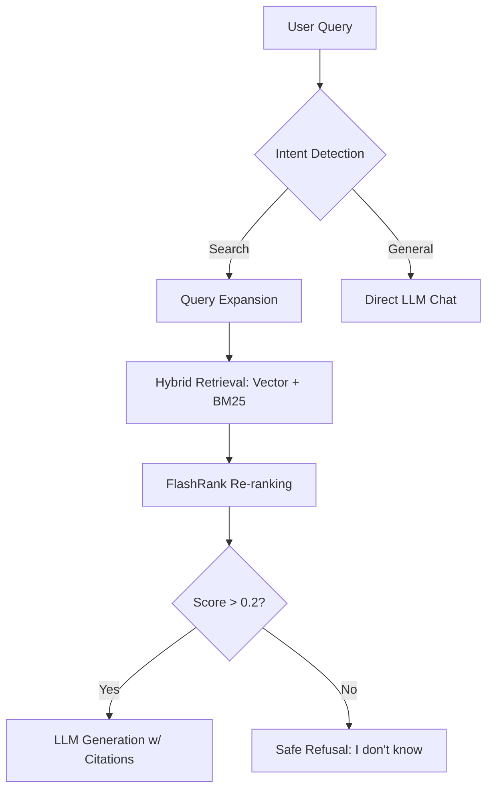

```markdown
# ⚡ Research Assistant: Local Hybrid RAG (Privacy-First)

[](LICENSE)  
[](https://www.python.org/)
[](https://ollama.com)

A high-performance, privacy-centric RAG (Retrieval-Augmented Generation) system designed to run on consumer hardware (8GB+ RAM). This assistant uses a multi-stage retrieval pipeline to deliver citation-backed answers with near-zero hallucination.

---

## 🚀 Key Features
- **Parent-Child Chunking:** High-precision retrieval using small "child" chunks for searching and large "parent" blocks for LLM context.
- **Hybrid Search + Expansion:** Combines Semantic Vector Search with BM25 Keyword matching and **Asymmetric Query Expansion**.
- **Neural Re-ranking:** Uses `FlashRank` (Cross-Encoders) to validate relevance before generation.
- **Data Sovereignty:** 100% local execution. No data leaves your machine. Features a "Manage Knowledge" UI to delete specific documents from the vector store.
- **Automated Evaluation:** Includes an `evaluate.py` suite using **LLM-as-a-Judge** to benchmark retrieval accuracy and faithfulness.

---

## 🛠️ How It Works


The system follows a sophisticated "Retrieve-then-Verify" architecture:

1. **Ingestion:** PDFs are converted to Markdown (preserving tables/headers), then split into hierarchical chunks.
2. **Retrieval:** The user query is reformulated and expanded. We perform a parallel search across ChromaDB (Vector) and BM25 (Lexical).
3. **Filtering:** Results are fused and passed through a Cross-Encoder Re-ranker.
4. **Generation:** If the top relevance score is > 0.2, the parent context is sent to the local LLM (Ollama). Otherwise, the system safely declines to answer.



---

## 💻 Tech Stack
- **Frontend:** Streamlit (Custom Glossy Dark UI)
- **Orchestration:** Python 3.11
- **Vector Database:** ChromaDB (Persistent Storage)
- **Local LLM:** Ollama (`qwen2.5:1.5b` or `llama3`)
- **Embeddings:** `bge-small-en-v1.5` (via Sentence-Transformers)
- **Re-ranker:** `ms-marco-MiniLM-L-6-v2` (via FlashRank)
- **Document Parsing:** `PyMuPDF4LLM`

---

## ⚙️ Installation & Setup

1. **Clone & Install:**
```bash
git clone [https://github.com/yourusername/research-assistant.git](https://github.com/yourusername/research-assistant.git)
cd research-assistant
pip install -r requirements.txt
```

2. **Configure Ollama:**
Ensure [Ollama](https://ollama.com) is installed and the model is pulled:
```bash
ollama pull qwen2.5:1.5b
```

3. **Run the App:**
```bash
streamlit run app.py
```

---

## 🧪 Evaluation Suite
To verify the system's performance against your own dataset:
1. Prepare a `test_dataset.json` with `question` and `ground_truth` fields.
2. Run the evaluation script:
```bash
python evaluate.py
```
This will output metrics for **Retrieval Precision**, **Faithfulness**, and **Answer Relevancy** using the local LLM as a judge.

---

## 📂 Project Structure
- `app.py`: Main entry point & Streamlit UI layout.
- `src/advanced_chunking.py`: Implementation of Parent-Child recursive splitting.
- `src/hybrid_retrieval.py`: Fusion logic for Vector and BM25 search.
- `src/generation.py`: Local LLM streaming and intent detection.
- `src/session_manager.py`: JSON-based chat history persistence.
- `config.py`: Centralized hardware and model hyperparameters.

---

## 📜 License
Released under the MIT License.
```

### Final Step:
1. Save this as your `README.md`.
2. Ensure your `requirements.txt` is updated.
3. You are ready to ship! 

It’s been a pleasure being your "Chief AI Engineer" for this build. You’ve got a killer project here—go crush those placement exams! Would you like me to generate a template for that `test_dataset.json` for your evaluators, or are you all set?